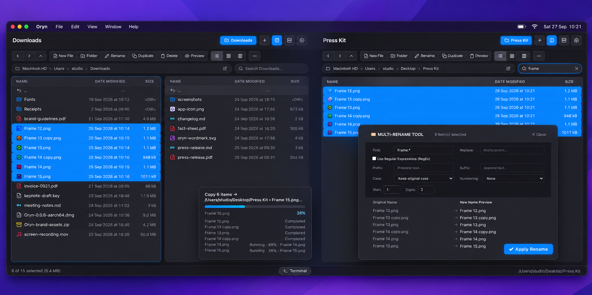
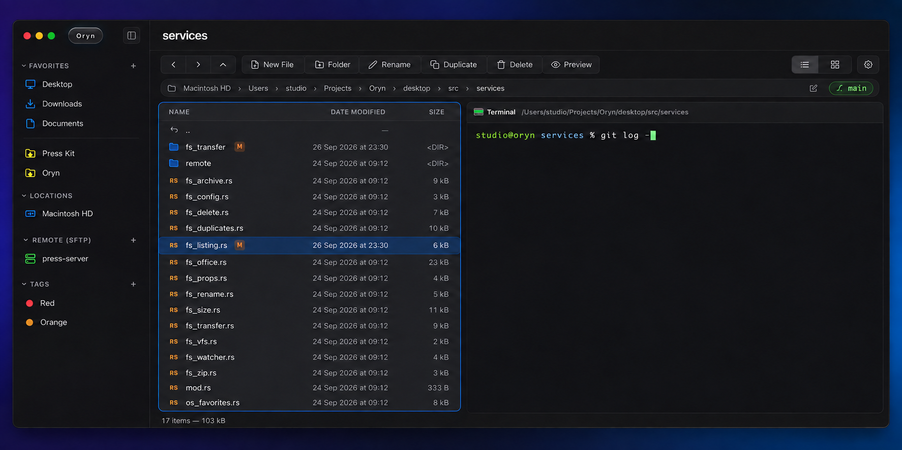
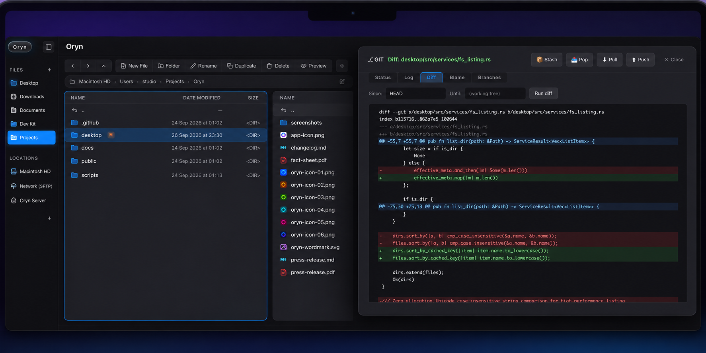

<p align="center">
  
</p>

<h1 align="center">Oryn</h1>

<p align="center">
  A two-pane file manager for macOS, Windows, and Linux.<br />
  Move files, browse projects, and work from the keyboard.
</p>

<p align="center">
  <a href="https://github.com/kaventro/Oryn/actions/workflows/ci.yml"></a>
  <a href="https://codecov.io/gh/kaventro/Oryn"></a>
  <a href="LICENSE"></a>
</p>

<p align="center">
  <video src="assets/showcase/oryn_promo.mp4" controls playsinline preload="metadata" width="100%"></video>
</p>

https://github.com/user-attachments/assets/342674fb-085d-4427-b835-71c7cf2768bb

## See it in use

Each panorama blends two steps of the same task. The original screenshots are linked below each image.

### Move files, then rename a batch

Select files in one pane and copy them to the folder in the other. The transfer stays visible while you continue browsing. The rename dialog shows the selected filenames before you apply a change.



[Transfer screenshot](assets/showcase/03_dual_pane_transfer.png) · [Rename screenshot](assets/showcase/06_multi_rename_tool.png)

### Browse a project, then open a terminal there

The file list shows the current path and Git branch. Open the terminal drawer to run a command in that directory.



[Project screenshot](assets/showcase/10_code_navigation.png) · [Terminal screenshot](assets/showcase/09_integrated_terminal.png)

### Check a change, then read its diff

Git status appears beside files and folders. Open the Git panel to inspect the changed lines.



[Status screenshot](assets/showcase/07_git_status_badges.png) · [Diff screenshot](assets/showcase/08_git_diff_viewer.png)

## What you can do

- Work in two independent panes with tabs and list, grid, or column views. Copy or move a selection between panes; rename several files with a preview.
- Preview files, edit text, search by name or content, and browse ZIP and TAR archives.
- See Git status in the file list, inspect diffs, and use a terminal in the current directory.
- Connect to remote directories over SFTP.

See [the feature guide](docs/FEATURES.md) for the full list and [keyboard shortcuts](docs/SHORTCUTS.md) for the keymap. For a quick start: `Tab` switches panes, `F5` copies to the other pane, `F6` moves, and `F9` toggles the terminal.

## Run from source

You need Node.js 20 or newer, Rust, and the [Tauri system prerequisites](https://v2.tauri.app/start/prerequisites/) for your operating system.

```sh
git clone https://github.com/kaventro/Oryn.git
cd Oryn
npm install
npm run dev
```

Build the desktop app with `npm run build`. To check a local change:

```sh
npm run typecheck
npm run ui:test
npm run ui:build
cargo test --manifest-path desktop/Cargo.toml
```

The TypeScript and Vite interface lives in `src/`; Tauri commands and Rust services live in `desktop/`. See [architecture](docs/ARCHITECTURE.md) and [contributing](CONTRIBUTING.md) for the repository layout and development conventions.

## License

Oryn is licensed under [AGPL-3.0](LICENSE).
