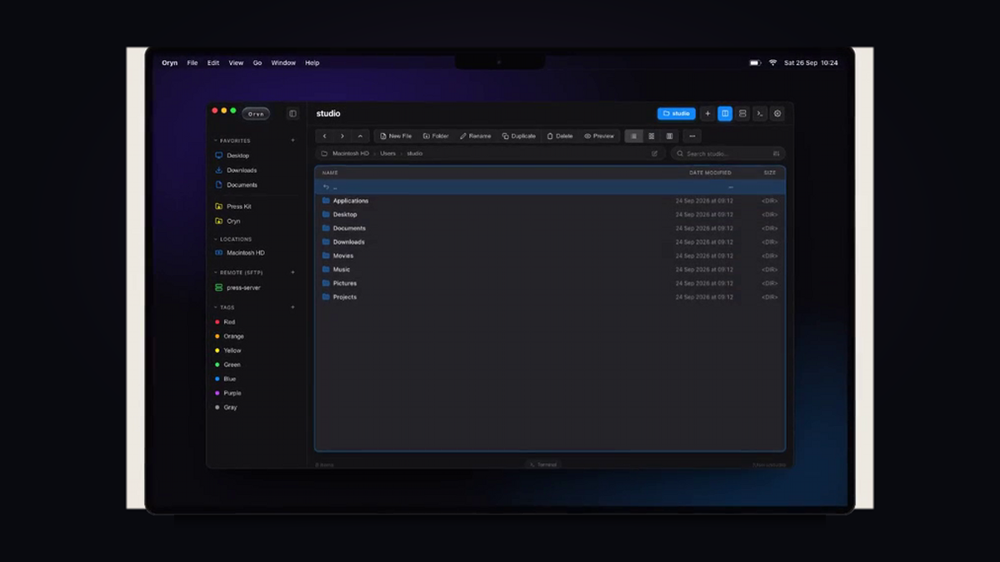
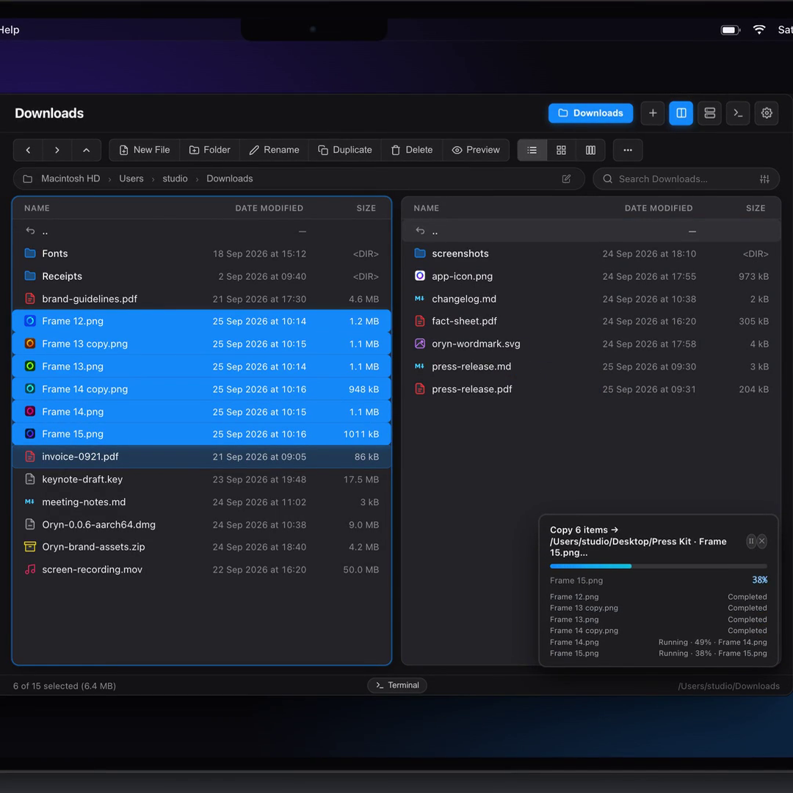
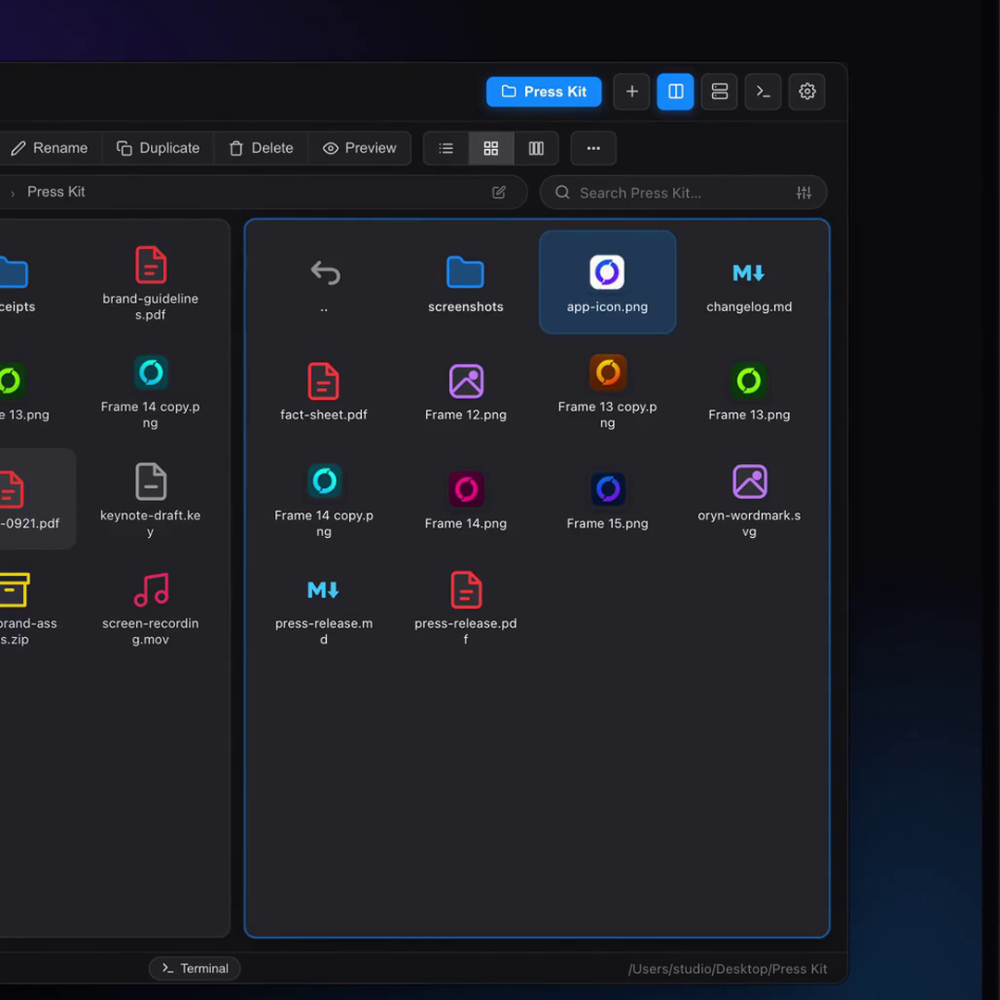
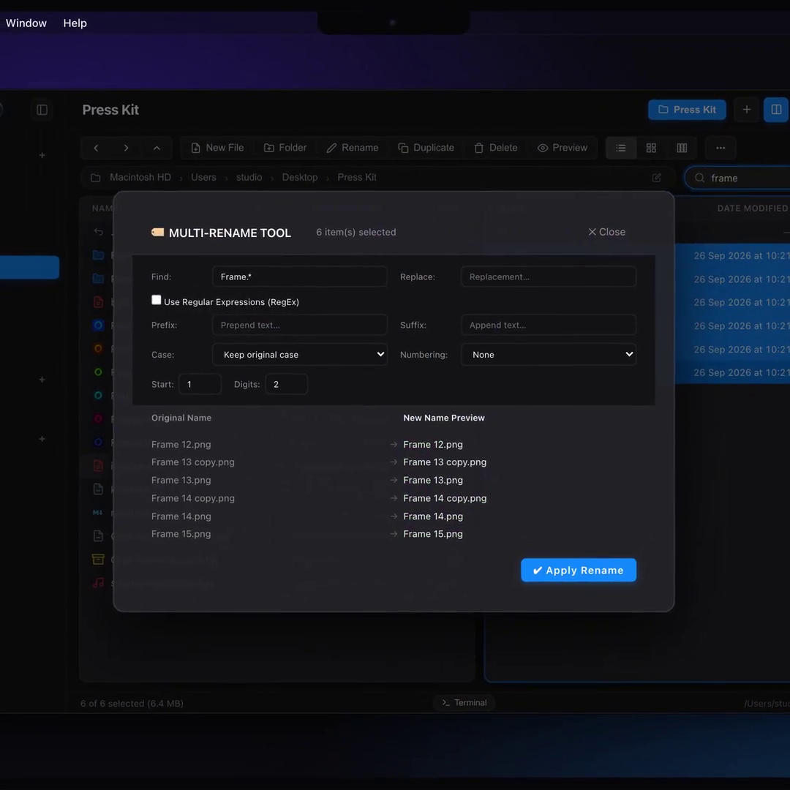
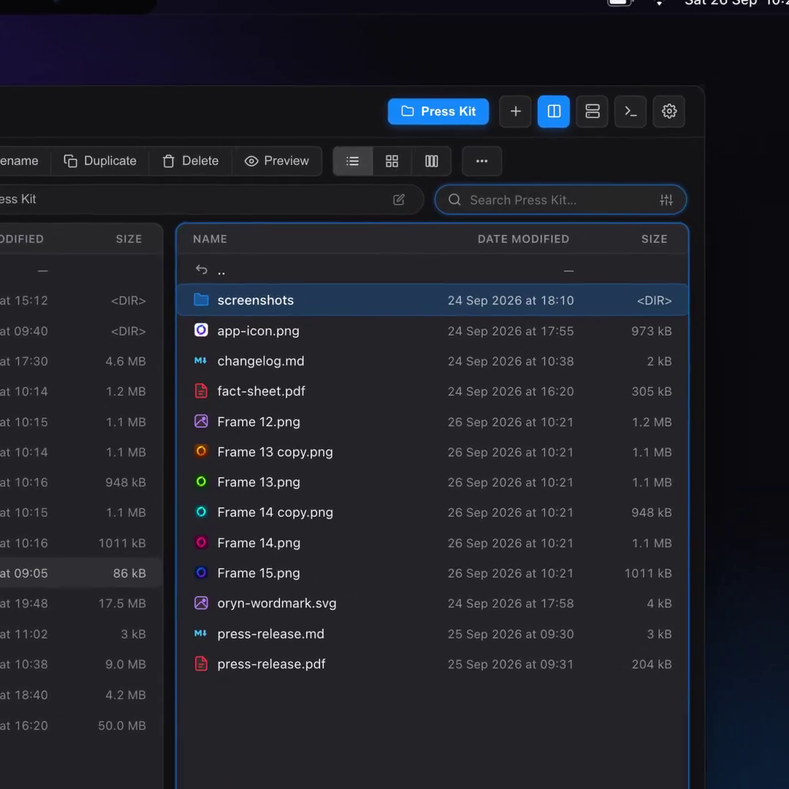
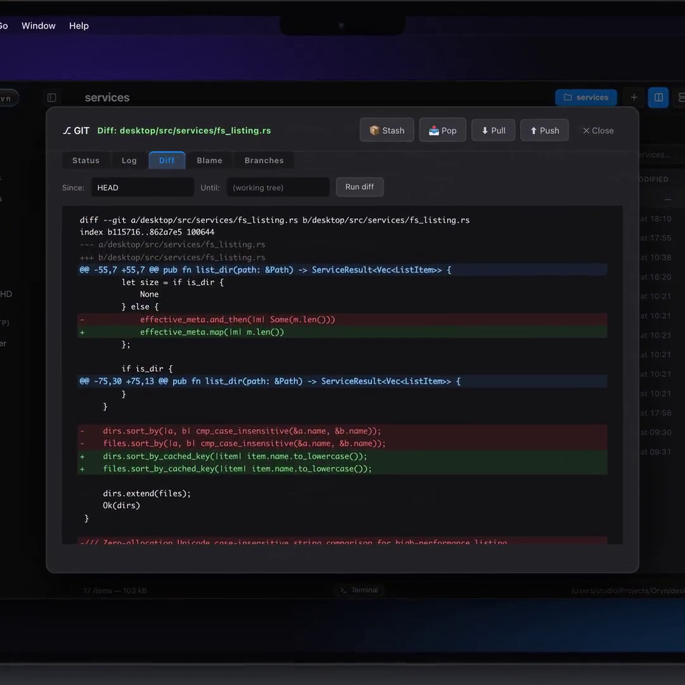
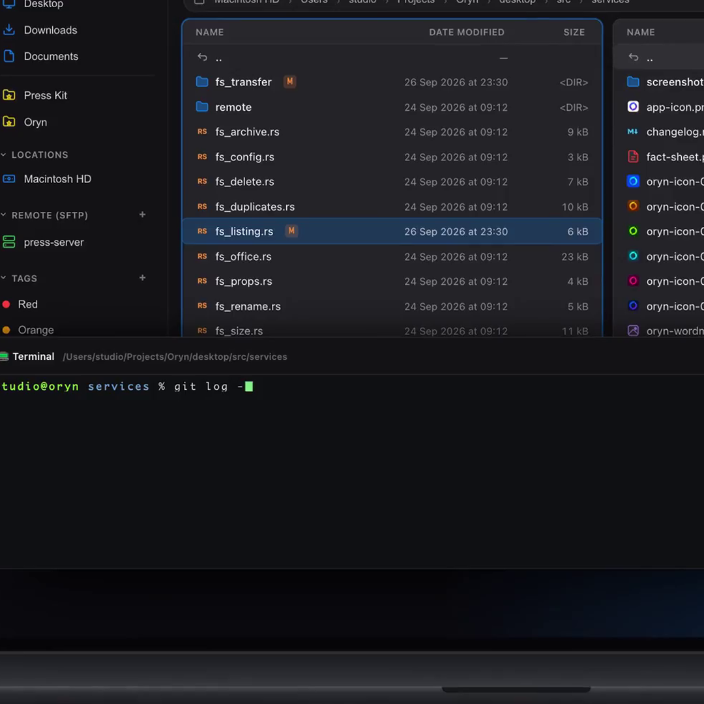
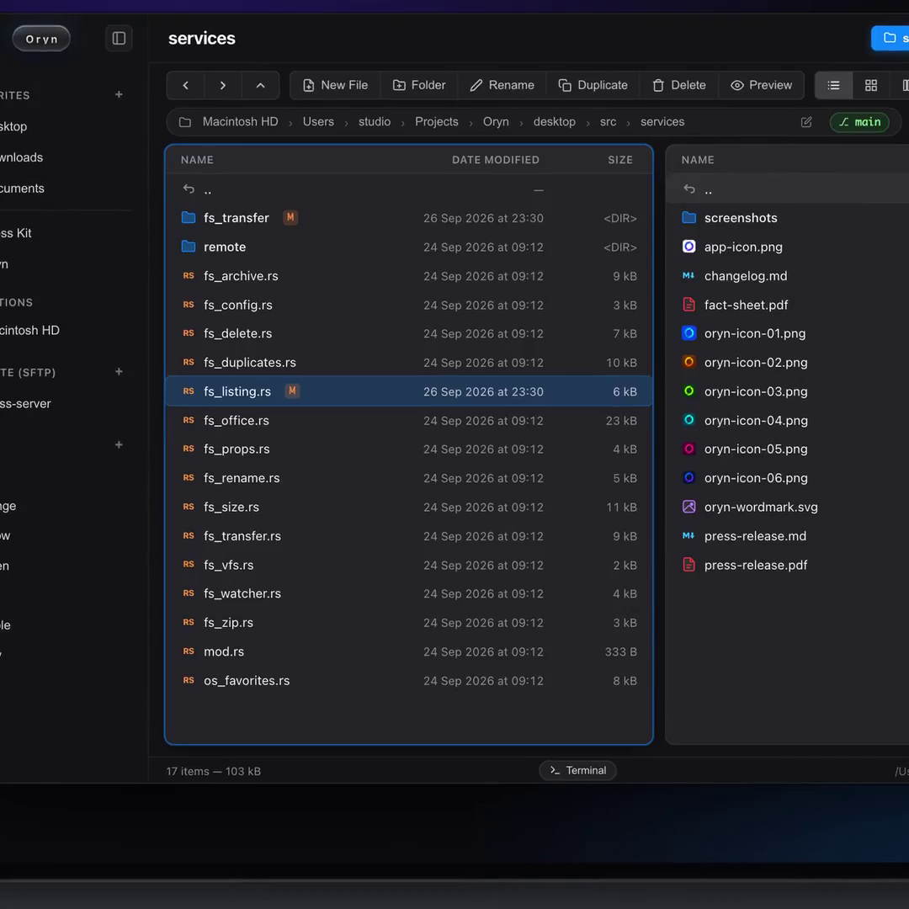
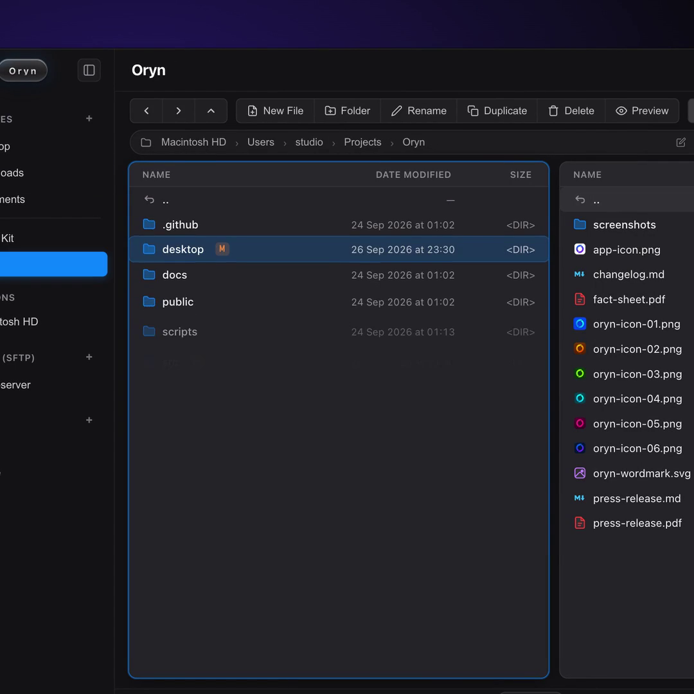
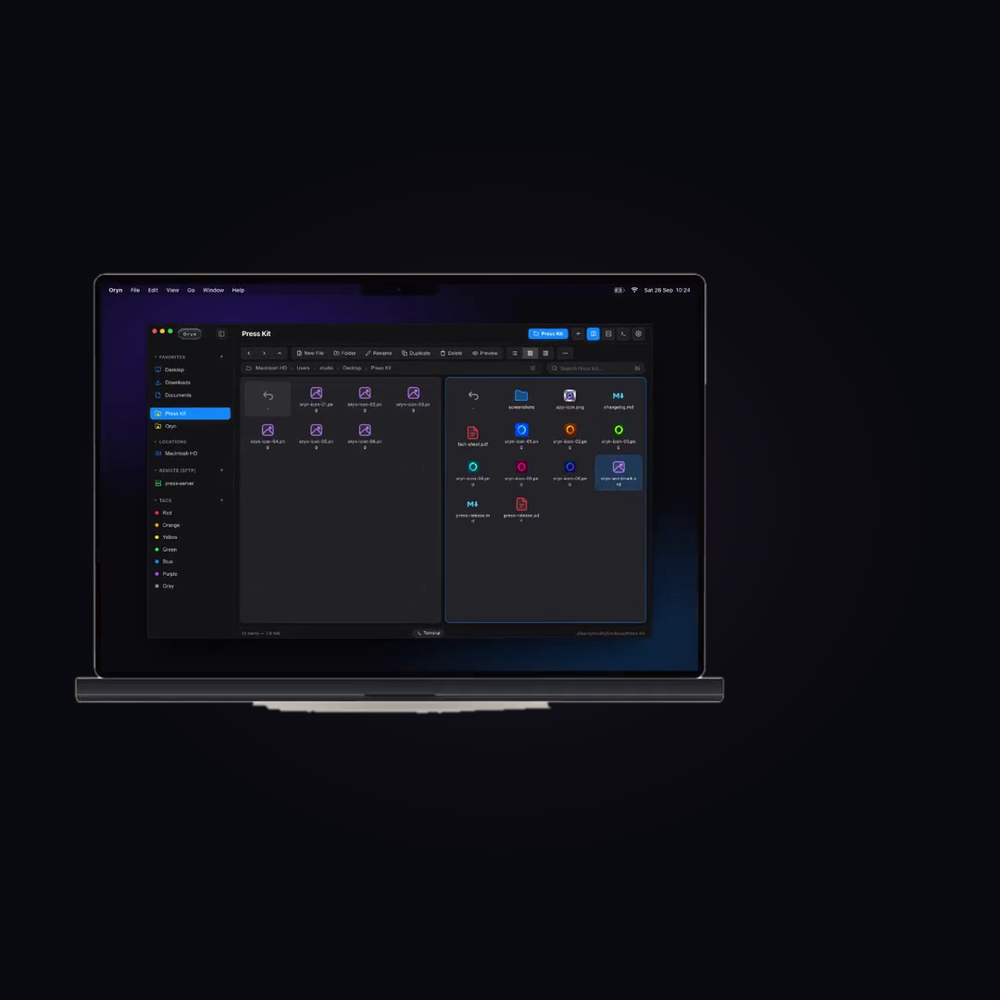

<p align="center">
  
</p>

<h1 align="center">Oryn</h1>

<p align="center">
  <strong>Your files. In flow.</strong><br />
  A modern, blazing-fast, keyboard-driven dual-pane file manager for developers and power users.<br />
  Crafted with <a href="https://v2.tauri.app">Tauri 2.11</a> (Rust 1.98) and TypeScript 7 / Vite — native, lightweight, and memory-safe.
</p>

<p align="center">
  <a href="https://github.com/kaventro/Oryn/actions/workflows/ci.yml"></a>
  <a href="https://codecov.io/gh/kaventro/Oryn"></a>
  <a href="https://codescene.io"></a>
  <a href="https://v2.tauri.app"></a>
  <a href="https://www.rust-lang.org"></a>
  <a href="https://www.typescriptlang.org"></a>
  
  <a href="LICENSE"></a>
</p>

<p align="center">
  
</p>

---

## ⚡ Why Oryn?

Traditional file managers force you to choose between ancient, clunky utilities with great keyboard shortcuts (*Total Commander*, *Far Manager*) and modern, bloated Electron apps that consume gigabytes of RAM.

**Oryn delivers the best of both worlds:**
- 🚀 **Sub-300ms Cold Start & Low Footprint** — Built on native OS webviews via **Tauri 2** and high-speed **Rust** backend engines. Zero Electron overhead.
- 🗂 **Dual-Pane Mastery & Multi-Tabs** — Two independent directory panes (Left & Right), tab sets, unified breadcrumbs, and instant switching with `Tab`.
- ⚡ **High-Throughput Transfer Pipeline** — Non-blocking asynchronous transfers, interactive conflict resolver (*Overwrite, Skip, Auto-Rename*), and background job HUD.
- 🛠 **Developer-First Power Tools** — Native Git status badges and visual Diff Viewer, integrated terminal drawer, in-place code editor with syntax highlighting for 50+ languages, and regex search.
- 🎨 **Tailored OS Aesthetics** — Pixel-perfect integration with macOS Sequoia frosted vibrancy, Windows 11 Mica & dark mode, and Linux GTK.

---

## 📸 Feature Showcase

<table>
  <tr>
    <td width="50%" align="center">
      <strong>🗂 Dual-Pane & Transfer HUD</strong><br /><br />
      
      <p align="left"><em>Independent side-by-side panes with live transfer progress, speed metrics, and non-blocking background queue.</em></p>
    </td>
    <td width="50%" align="center">
      <strong>🖼 Visual Media Grid & Thumbnails</strong><br /><br />
      
      <p align="left"><em>Smooth 60fps virtualized grid view with instant high-resolution image thumbnails and active file indicators.</em></p>
    </td>
  </tr>
  <tr>
    <td width="50%" align="center">
      <strong>🏷 Batch Multi-Rename Tool</strong><br /><br />
      
      <p align="left"><em>Dynamic pattern tokens (<code>[N]</code>, <code>[E]</code>, <code>[YMD]</code>), RegEx search & replace, and live preview before executing.</em></p>
    </td>
    <td width="50%" align="center">
      <strong>🔍 Instant Search & Live Filtering</strong><br /><br />
      
      <p align="left"><em>In-place instant filtering across tens of thousands of items with sub-millisecond response times.</em></p>
    </td>
  </tr>
  <tr>
    <td width="50%" align="center">
      <strong>🌿 Built-in Git Status & Diff Viewer</strong><br /><br />
      
      <p align="left"><em>Visual syntax-highlighted side-by-side and unified diffs with instant Stash, Pull, and Push operations.</em></p>
    </td>
    <td width="50%" align="center">
      <strong>💻 Integrated Terminal Drawer</strong><br /><br />
      
      <p align="left"><em>Collapsible terminal drawer bound to the active directory for running build tools, scripts, and commands.</em></p>
    </td>
  </tr>
  <tr>
    <td width="50%" align="center">
      <strong>🦀 Code Navigation & Git Branches</strong><br /><br />
      
      <p align="left"><em>Native source tree browsing with language icons, active Git branch tracking (<code>[~ main]</code>), and instant folder inspection.</em></p>
    </td>
    <td width="50%" align="center">
      <strong>🏷 Live Git Status Badges & File Tree</strong><br /><br />
      
      <p align="left"><em>Real-time color-coded status badges (<code>[M]</code>, <code>[A]</code>, <code>[?]</code>) directly in the file list without running external commands.</em></p>
    </td>
  </tr>
</table>

<p align="center">
  
  <br />
  <em>One unified experience, native keyboard shortcuts, and uncompromised speed across macOS, Windows 11, and Linux.</em>
</p>

---

## 🚀 Key Capabilities

### 🗂 Dual-Pane & Multi-View Workspace
- **Three Layout Engines:** **List View** (`⌘1` / `Ctrl+1`) with 60fps virtualized scrolling, **Grid View** (`⌘2` / `Ctrl+2`) for visual assets, and **Miller Columns** (`⌘3` / `Ctrl+3`) for deep hierarchical inspection.
- **Multi-Tab Workspaces:** Open multiple tabs per pane (`⌘T` / `Ctrl+T`) with preserved scroll positions, selections, and history.
- **Filesystem Watcher:** Instant updates via Rust's native `notify` engine when files are modified externally.
- **Interactive Breadcrumbs:** Clickable path segments and address bar (`⌘L` / `Ctrl+L`) with autocompletion.

### ⚡ Blazing Fast Transfers & Archives
- **Rust Stream Engine:** Multi-gigabyte transfers with live ETA, transfer speeds, and progress bars.
- **Interactive Conflict Resolver:** Batch resolve collisions with *Overwrite, Skip, Auto-Rename*, or *"Apply to all"*.
- **Virtual File System (VFS):** Browse `.zip` and `.tar.gz` archives transparently as regular folders without prior extraction.

### 👁 Universal Quick Look & In-Place Editor
- **Syntax Highlighting:** Instant preview for 50+ languages with line numbering.
- **In-Place Editing:** Press `⌘E` / `Ctrl+E` to edit Markdown, JSON, configs, or code directly inside Oryn with `⌘S` / `Ctrl+S` saving.
- **Rich Document Support:** Markdown rendering, image inspector with EXIF data, audio/video playback, and Office files (`.docx`, `.xlsx`, `.pptx`).

### 🛠 Built-in Developer Power Tools
- **Git Integration:** File tree status badges (`[M]`, `[A]`, `[?]`), visual Diff Viewer, and staging tools.
- **Spotlight Command Palette (`⌘P` / `Ctrl+P`):** Fuzzy-search every action, setting, and command instantly.
- **Disk Space Analyzer:** Visual treemaps to pinpoint large folders and reclaim storage.
- **SHA-256 Duplicate Finder:** Multi-threaded cryptographic scan to identify duplicate files.
- **Remote SFTP / SSH:** Seamlessly manage remote servers and transfer files between local and cloud directories.

---

## ⌨️ Essential Keyboard Shortcuts

| Action | macOS | Windows / Linux |
| :--- | :--- | :--- |
| **Switch Active Pane** | `Tab` | `Tab` |
| **Switch View (List / Grid / Columns)** | `⌘1` / `⌘2` / `⌘3` | `Ctrl+1` / `Ctrl+2` / `Ctrl+3` |
| **Quick Look Preview / Folder Size** | `Space` / `F3` | `Space` / `F3` |
| **Copy Selection to Opposite Pane** | `F5` | `F5` |
| **Move Selection to Opposite Pane** | `F6` | `F6` |
| **New Folder (`mkdir`) / New File** | `F7` / `Shift+F7` | `F7` / `Shift+F7` |
| **Move to Trash / Permanent Delete** | `F8` / `Delete` | `F8` / `Delete` |
| **Spotlight Command Palette** | `⌘P` / `⌘K` | `Ctrl+P` / `Ctrl+K` |
| **Quick Filter / Full Search** | `⌘F` / `Alt+F7` | `Ctrl+F` / `Alt+F7` |
| **Batch Multi-Rename Tool** | `⌘M` | `Ctrl+M` |
| **Toggle Terminal Drawer** | `F9` / `Ctrl+\`` | `F9` / `Ctrl+\`` |
| **Preferences & Settings** | `⌘,` | `Ctrl+,` |

📖 *For the complete keymap reference including VIM mode, archive operations, and Git shortcuts, see [docs/SHORTCUTS.md](docs/SHORTCUTS.md).*

---

## 🏗 Architecture & Engineering Standards

Oryn is designed strictly around **Clean Architecture** (4 decoupled layers) and **SOLID** principles:

```text
┌────────────────────────────────────────────────────────┐
│  1. Presentation Layer (UI / Views / Renderers)        │  ← Strict rendering, no IPC calls
└───────────────────────────┬────────────────────────────┘
                            ▼
┌────────────────────────────────────────────────────────┐
│  2. Application / State Layer (EventBus / AppState)    │  ← Reactive state & decoupled events
└───────────────────────────┬────────────────────────────┘
                            ▼
┌────────────────────────────────────────────────────────┐
│  3. Domain Layer (Interfaces, Business Rules, Models)  │  ← Pure business logic & contracts
└───────────────────────────┬────────────────────────────┘
                            ▼
┌────────────────────────────────────────────────────────┐
│  4. Infrastructure / API Layer (Tauri IPC, Storage)    │  ← Typed OS bridge & native services
└───────────────────────────┴────────────────────────────┘
```

- **Backend:** [Rust](https://www.rust-lang.org/) (≥ 1.98.0) + [Tauri 2](https://v2.tauri.app/) (2.11.x) — async `tokio`, `notify` filesystem events, `win32job` process containment, and cross-platform native clipboard.
- **Frontend:** [TypeScript 7](https://www.typescriptlang.org/) + [Vite](https://vite.dev/) — zero heavy runtime frameworks, 60fps virtualized lists, typed event bus, sub-300ms startup.

🏛 *For detailed subsystem diagrams and architectural documentation, see [docs/ARCHITECTURE.md](docs/ARCHITECTURE.md).*

---

## 📦 Getting Started

### Prerequisites
- **Node.js** ≥ 20.x
- **Rust** ≥ 1.98.0 (`rustup default stable`)
- Platform C++ build tools:
  - **macOS:** Xcode Command Line Tools (`xcode-select --install`)
  - **Windows:** Visual Studio C++ Build Tools
  - **Linux:** `libwebkit2gtk-4.1-dev`, `build-essential`, `libssl-dev`

### Development Workflow

```bash
# 1. Clone the repository
git clone https://github.com/kaventro/Oryn.git
cd Oryn

# 2. Install dependencies
npm install

# 3. Launch in desktop development mode (Vite HMR + Tauri backend)
npm run dev
```

### Testing & Quality Assurance

```bash
# Verify TypeScript strict typing
npm run typecheck

# Run frontend unit test suite
npm run ui:test

# Run Rust backend test suite
cargo test --manifest-path desktop/Cargo.toml

# Build production frontend bundle
npm run ui:build
```

### Production Build

```bash
# Build standalone native executables and installers (.dmg / .exe / .AppImage / .deb)
npm run build
```

---

## 📄 License

Oryn is open-source software licensed under the **[GNU Affero General Public License v3.0 (AGPL-3.0)](LICENSE)**.
Feel free to contribute, open discussions, and submit pull requests.
