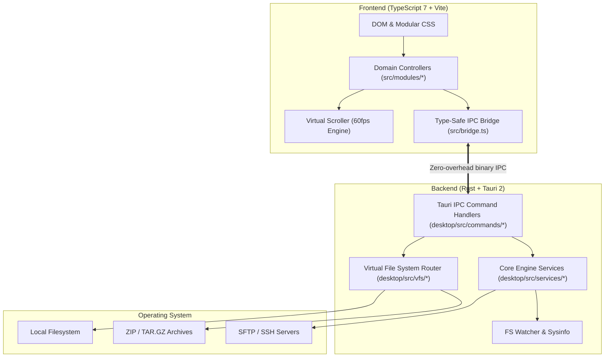

# Oryn Architecture & Tech Stack

A deep-dive into the internal design, subsystem layering, and technical architecture of **Oryn**.

---

## 🏛 High-Level Design Overview

Oryn is designed with a lightweight, high-performance architecture that separates native OS capabilities from the modern UI layer via **Tauri 2 IPC**:



---

## 📂 Repository Layout

```
Oryn/
├── src/                               # Frontend application (TypeScript 7 + Vite)
│   ├── index.html                     # Main window markup and modal overlays
│   ├── app.ts                         # App bootstrap, lifecycle, and controller wiring
│   ├── bridge.ts                      # Strongly-typed Tauri 2 IPC wrapper
│   ├── styles.css                     # Main stylesheet bundling all modular CSS
│   ├── modules/                       # Domain-specific controllers & managers
│   │   ├── columns/                   # Miller columns view & hierarchical navigation
│   │   ├── git/                       # Git status, branch log, diff, and blame
│   │   ├── icons/                     # SVG icon registry and dynamic extension mappings
│   │   ├── rows/                      # High-speed row renderer and DOM recycling
│   │   ├── search/                    # Search runner, session store, and virtualized results
│   │   ├── settings/                  # User preferences model and HotkeyRegistry
│   │   ├── virtualList/               # 60fps windowed virtual scroller engine
│   │   ├── commandsController.ts      # Action dispatcher, Quick Look, in-place editor
│   │   ├── keyboardController.ts      # Global key routing, shortcuts, type-to-jump, VIM
│   │   ├── listRenderer.ts            # High-density file list painter
│   │   ├── pathHeaderController.ts    # Breadcrumb bar & manual path input
│   │   ├── sidebarController.ts       # Favorites, pinned folders, and drive list
│   │   ├── terminalDrawerController.ts# Integrated command drawer controller
│   │   └── viewController.ts          # View mode manager (List / Grid / Columns)
│   └── styles/                        # Modular CSS architecture
│       ├── 01-vars.css                # Color palettes, spacing, and frosted glass tokens
│       ├── 02-layout.css              # Dual pane flex/grid layout and splitters
│       ├── 03-components.css          # Buttons, toolbars, tags, and status bar
│       ├── 04-rows.css                # File row styles and hover/selection states
│       ├── 05-modals.css              # Base dialog and overlay styling
│       ├── 06-git.css                 # Git diff and history styles
│       ├── 07-scrollbars.css          # Native-feeling slim scrollbars
│       ├── 08-power-tools.css         # Treemap analyzer and multi-rename styling
│       └── components/ & modals/      # Granular component CSS definitions
├── desktop/                           # Native Rust backend (Tauri 2)
│   ├── Cargo.toml                     # Rust crate configuration & dependencies
│   ├── tauri.conf.json                # Tauri 2 configuration, windows, permissions
│   ├── capabilities/                  # Security capabilities & allowed IPC scopes
│   ├── permissions/                   # Custom command permission manifests
│   └── src/
│       ├── main.rs / lib.rs           # Tauri app initialization and plugin setup
│       ├── fs_safe.rs                 # Safe path validation and traversal guards
│       ├── commands/                  # IPC commands exposed to the frontend
│       │   ├── archive_cmd/           # ZIP / TAR packaging and extraction
│       │   ├── compare_cmd/           # Side-by-side folder comparison
│       │   ├── fs/                    # Directory listing, file read/write, delete
│       │   ├── git_cmd/               # Git status, diff, blame, and stage/restore
│       │   ├── replace_cmd/           # Batch search & replace in files
│       │   ├── search_cmd/            # Multi-threaded ripgrep-style search engine
│       │   ├── dialog_cmd.rs          # Native OS file/folder pickers
│       │   ├── path.rs                # Cross-platform path normalization
│       │   ├── remote_cmd.rs          # SFTP / SSH connection manager
│       │   ├── shell_cmd.rs           # External tool launch (VS Code, terminal)
│       │   ├── system_cmd.rs          # Drive list, system stats, disk capacity
│       │   └── window_cmd.rs          # Native window minimize, zoom, fullscreen
│       ├── services/                  # Core backend business logic
│       │   ├── fs_archive.rs          # Archive compression & decompression
│       │   ├── fs_duplicates.rs       # Multi-threaded SHA-256 duplicate scanner
│       │   ├── fs_listing.rs          # High-performance directory scanner
│       │   ├── fs_office.rs           # DOCX / XLSX / PPTX document extractors
│       │   ├── fs_props.rs            # File metadata & permission inspector
│       │   ├── fs_rename.rs           # Pattern-based batch renaming engine
│       │   ├── fs_size.rs             # Asynchronous directory size calculator
│       │   ├── fs_transfer/           # High-throughput chunked transfer pipeline
│       │   ├── fs_watcher.rs          # Real-time filesystem event watcher (`notify`)
│       │   └── remote/                # SSH/SFTP session handling & operations
│       └── vfs/                       # Virtual File System abstraction
│           ├── router.rs              # Path routing (Local vs Archive vs Remote)
│           ├── types.rs               # VFS traits and entry definitions
│           └── providers/             # Local, ZIP, and TAR VFS providers
├── docs/                              # Project documentation & specs
│   ├── ARCHITECTURE.md                # System architecture (this file)
│   ├── FEATURES.md                    # Detailed feature guide
│   ├── SHORTCUTS.md                   # Complete hotkey reference
│   └── design/                        # Historical architectural specs & refactor plans
└── .github/workflows/                 # Automated cross-platform CI/CD release pipeline
```

---

## 💻 Frontend Architecture

### 1. Zero-Framework Philosophy
- Built using **pure TypeScript 7** without React, Vue, or Angular overhead.
- Direct DOM manipulation with localized redraws and document fragments for near-zero CPU and memory footprint.
- Sub-300ms startup times and sustained 60fps animations.

### 2. High-Performance Virtual Scrolling
- `VirtualScroller` calculates visible viewport slices dynamically based on scroll offset.
- Reuses and recycles row elements in the DOM to seamlessly render directories containing over 100,000 files with constant memory usage.

### 3. Controller Architecture
- Domain logic is modularized into discrete controllers (`PanelController`, `GitController`, `SearchController`, `FileOpsController`).
- State is decoupled into explicit data models (`AppState`, `PaneState`, `TabState`) to facilitate multi-tab and dual-pane isolation.

---

## ⚙️ Backend Architecture (Rust)

### 1. Virtual File System (VFS)
- The VFS layer abstracts filesystem access through uniform traits (`VfsProvider`).
- Allows users to enter and navigate `.zip` and `.tar.gz` archives seamlessly without prior extraction.

### 2. High-Throughput Chunked Transfer Pipeline
- File transfers run over asynchronous chunked streaming buffers with pause/resume and cancellation support.
- Live progress, ETA, and speed metrics are throttled and broadcast to the frontend via Tauri events.

### 3. Safety & Security
- Strict path sanitization (`fs_safe.rs`) prevents path-traversal attacks and illegal symlink escalations.
- Tauri 2 capability manifests enforce fine-grained IPC access control.
